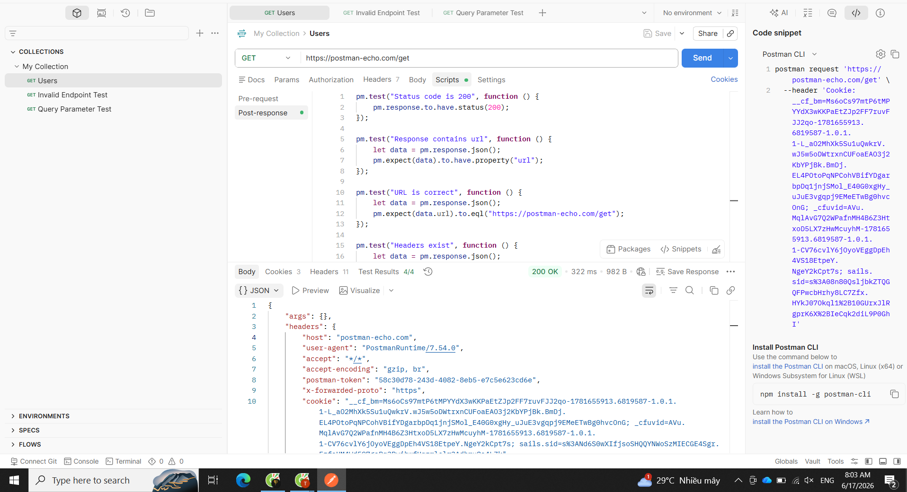
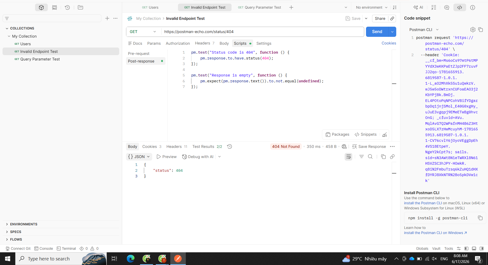
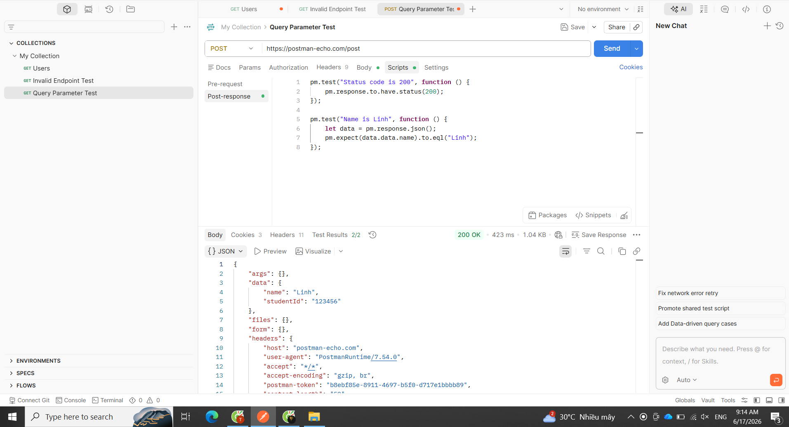

# BÁO CÁO THỰC HÀNH KIỂM THỬ API BẰNG POSTMAN

## Thông tin sinh viên

* Tên dự án: Postman API Testing Project
* Họ và tên: Lê Thị Kiều Trang
* Môn học: Kiểm thử phần mềm

---

# 1. Mục tiêu

Tìm hiểu và thực hành sử dụng công cụ Postman để kiểm thử API. Thực hiện gửi HTTP Request, kiểm tra Response và xây dựng các kịch bản kiểm thử tự động bằng Test Script.

---

# 2. Môi trường kiểm thử

* Công cụ: Postman
* API sử dụng: Postman Echo API
* Hệ điều hành: Windows
* Phương pháp kiểm thử: Thủ công kết hợp tự động bằng Test Script

---

# 3. Kịch bản kiểm thử

## Kịch bản 1: Kiểm thử API GET

### Mục đích

Kiểm tra khả năng gửi Request và nhận Response từ API.

### Request

```http
GET https://postman-echo.com/get
```

### Test Script

```javascript
pm.test("Status code is 200", function () {
    pm.response.to.have.status(200);
});

pm.test("Response contains URL", function () {
    let data = pm.response.json();
    pm.expect(data).to.have.property("url");
});

pm.test("URL is correct", function () {
    let data = pm.response.json();
    pm.expect(data.url).to.eql("https://postman-echo.com/get");
});
```

### Kết quả mong đợi

* API trả về HTTP Status 200.
* Response chứa trường `url`.

### Kết quả thực tế

* API trả về HTTP Status 200.
* Response chứa đầy đủ thông tin Request.

### Trạng thái

✅ Thành công

### Hình minh họa



---

## Kịch bản 2: Kiểm thử Endpoint không tồn tại

### Mục đích

Kiểm tra cách hệ thống xử lý khi người dùng truy cập endpoint không hợp lệ.

### Request

```http
GET https://postman-echo.com/status/404
```

### Test Script

```javascript
pm.test("Status code is 404", function () {
    pm.response.to.have.status(404);
});
```

### Kết quả mong đợi

* API trả về lỗi 404 Not Found.

### Kết quả thực tế

* API trả về lỗi HTTP 404.

### Trạng thái

✅ Thành công (đúng với kết quả mong đợi)

### Hình minh họa



---

## Kịch bản 3: Kiểm thử API POST

### Mục đích

Kiểm tra khả năng gửi dữ liệu từ Client đến Server.

### Request

```http
POST https://postman-echo.com/post
```

### Body

```json
{
    "name": "Linh",
    "studentId": "123456"
}
```

### Test Script

```javascript
pm.test("Status code is 200", function () {
    pm.response.to.have.status(200);
});

pm.test("Name is Linh", function () {
    let data = pm.response.json();
    pm.expect(data.data.name).to.eql("Linh");
});
```

### Kết quả mong đợi

* API nhận dữ liệu gửi lên.
* Trả về đúng giá trị đã gửi.

### Kết quả thực tế

* API nhận dữ liệu thành công.
* Dữ liệu trả về khớp với dữ liệu gửi lên.

### Trạng thái

✅ Thành công

### Hình minh họa



---

# 4. Kết quả kiểm thử

| Kịch bản     | Kết quả    |
| ------------ | ---------- |
| GET Request  | Thành công |
| GET 404      | Thành công |
| POST Request | Thành công |

### Thống kê

* Tổng số kịch bản kiểm thử: 3
* Số kịch bản thành công: 3
* Số kịch bản thất bại: 0
* Tỷ lệ thành công: 100%

---

# 5. Kiến thức thu được

Sau khi thực hành, em đã:

* Hiểu được cách sử dụng Postman.
* Thực hiện được các phương thức HTTP cơ bản (GET, POST).
* Kiểm tra mã trạng thái HTTP.
* Phân tích dữ liệu JSON trả về từ API.
* Viết Test Script bằng JavaScript để tự động kiểm thử API.

---

# 6. Kết luận

Qua bài thực hành, sử dụng thành công công cụ Postman để kiểm thử API. Các kịch bản kiểm thử được thực hiện đúng yêu cầu và cho kết quả như mong đợi. Postman là công cụ hữu ích giúp kiểm thử API nhanh chóng, trực quan và hỗ trợ hiệu quả trong quá trình phát triển phần mềm.
